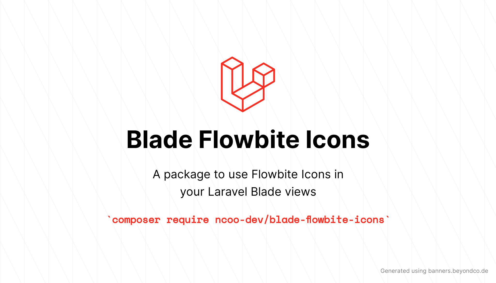

<p align="center">
    
</p>

# Flowbite Blade Icons

<a href="https://github.com/themesberg/flowbite-blade-icons/actions?query=workflow%3ATests">
    
</a>
<a href="https://packagist.org/packages/themesberg/flowbite-blade-icons">
    
</a>
<a href="https://packagist.org/packages/themesberg/flowbite-blade-icons">
    
</a>

A package to easily make use of [Flowbite Icons](https://flowbite.com/icons/) in your Laravel Blade views.

For a full list of available icons see [the SVG directory](resources/svg) or preview them at [flowbite.com](https://flowbite.com/icons/).

## Requirements

- PHP 8.1 or higher
- Laravel 9.0 or higher

## Installation

```bash
composer require themesberg/flowbite-blade-icons
```

## Updating

Please refer to [`the upgrade guide`](UPGRADE.md) when updating the library.

## Blade Icons

Flowbite Blade Icons uses Blade Icons under the hood. Please refer to [the Blade Icons readme](https://github.com/blade-ui-kit/blade-icons) for additional functionality. We also recommend to [enable icon caching](https://github.com/blade-ui-kit/blade-icons#caching) with this library.

## Configuration

Flowbite Blade Icons also offers the ability to use features from Blade Icons like default classes, default attributes, etc. If you'd like to configure these, publish the `flowbite-blade-icons.php` config file:

```bash
php artisan vendor:publish --tag=flowbite-blade-icons-config
```

## Usage

Icons can be used as self-closing Blade components which will be compiled to SVG icons:

```blade
<x-fwb-o-adjustments-horizontal/>
```

You can also pass classes to your icon components:

```blade
<x-fwb-o-adjustments-horizontal class="w-6 h-6 text-gray-500"/>
```

And even use inline styles:

```blade
<x-fwb-o-adjustments-horizontal style="color: #555"/>
```

Or use the @svg directive:

```blade
@svg('fwb-o-adjustments-horizontal', 'w-6 h-6', ['style' => 'color: #555'])
```

The solid icons can be referenced like this:

```blade
<x-fwb-s-adjustments-horizontal/>
```

### Raw SVG Icons

If you want to use the raw SVG icons as assets, you can publish them using:

```bash
php artisan vendor:publish --tag=flowbite-blade-icons --force
```

Then use them in your views like:

```blade

```

## Changelog

Check out the [CHANGELOG](CHANGELOG.md) in this repository for all the recent changes.

## Maintainers

Blade Flowbite Icons is developed and maintained by [Dominique Thomas](https://github.com/domthomas-dev) in collaboration :
- Icons designed by [Evelyne Krall](https://twitter.com/EvelyneKrall) 
- Icons integrated in Figma by [Robert Tanislav](https://twitter.com/roberttanislav)
- Coding the interface to search icon by [Zoltán Szőgyényi](https://github.com/zoltanszogyenyi)

## License

Flowbite Blade Icons is open-sourced software licensed under [the MIT license](LICENSE.md).
